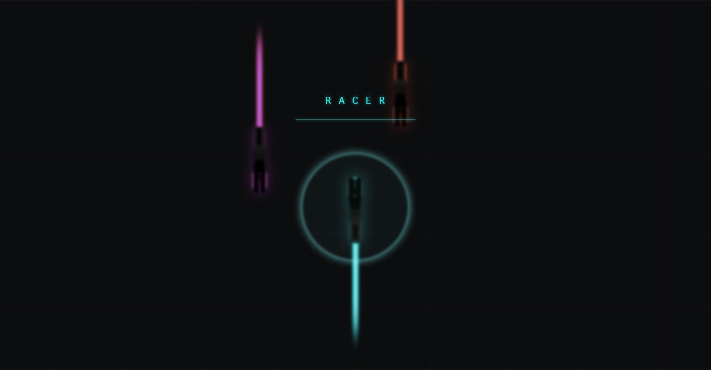

## RACR
A game made for the [Denver Dev's](http://denverdevs.com) Code Challenge. Basically Tron, but updated and tweaked out.

## Build
To build and run locally.
- `cd` into project directory
- run `npm install`
- run `bower install`
- run `gulp`
- rock and roll, let'r rip!

## Notes
Some general notes on how things work.

###Data
Data is where character data is held as well as all game assets.

###GameView
GameView is a special view that deals with more details such as collision detection and such.

###Views
Each view is responsible for "characters" it brings characters into existance and calls their update.

###Characters
Each character is responsible for its own state and what it is doing, it can be acted upon by its parent view.

## TODO
- [ ] Mute
- [ ] Instructions
- [ ] New Enemies
- [ ] Walls
- [ ] Player enhancements
	- [ ] Force Field
	- [ ] Spray Fire
	- [ ] Bombs
- [ ] Enemy Enhancements
	- [ ] Bombs
	- [ ] Directions
	- [ ] Spawning
- [ ] Cleanup
	- [ ] DRY THAT SHIT UP YO
	- [ ] Clean up character inheritance
	- [ ] Clean up sprites
	- [ ] Clean up gameplay logic